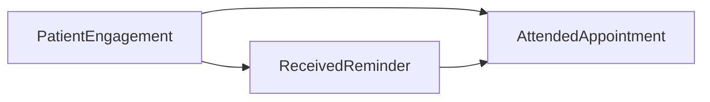
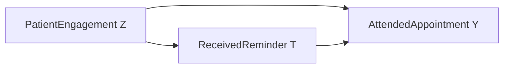

**Concept:** Interventions

# The Reminder Puzzle

## The Reminder Puzzle

You get a text from your clinic: *'Don't forget your appointment tomorrow!'* Later, the clinic checks its records and notices something striking — patients who received that text were much more likely to show up than patients who did not.

Should the clinic celebrate? Did the text reminder *cause* better attendance?

Not so fast. This lesson is about that puzzle.

> **After this mini lesson, you will be able to:**
> - Spot why a pattern in data does not automatically prove cause and effect.
> - Name the hidden factor that might quietly explain the attendance gap.
> - Describe, in plain words, what it would mean to truly *test* whether a reminder works.

## Before We Dive In

Most of us have a very natural instinct: *if two things happen together, one probably caused the other.* Reminded patients show up more → reminders must work. It feels obvious.

But here is the trap. The patients who received a reminder and the patients who did not may have already been different from each other *before* any text was ever sent. Some patients have a stable routine, a charged phone, and a registered mobile number on file. Others are harder to reach — maybe they move frequently, work unpredictable hours, or have an old number on record. Those background differences could be doing most of the heavy lifting, quietly shaping both *who gets a reminder* and *who shows up anyway*.

So the attendance gap might be real, but the reminder might deserve less credit than it appears to.

## Meet the Hidden Driver

Let's give our three players proper names.

- **PatientEngagement ($Z$):** How engaged, digitally connected, and life-stable a patient already is before any reminder is sent. Think: do they have a working mobile number on file? Do they tend to keep appointments?
- **ReceivedReminder ($T$):** Whether the clinic's system actually sent a text to that patient.
- **AttendedAppointment ($Y$):** Whether the patient walked through the clinic door.

Here is the key idea: **Z quietly influences both T and Y at the same time.**

A highly engaged patient is more likely to have a valid number on file, so the system can reach them — that is Z nudging T. That same patient is also more likely to show up regardless — that is Z nudging Y directly. So even if the reminder did *nothing at all*, we would still see reminded patients attending more, simply because they were already a different group.

This kind of hidden driver — one that pulls on both the thing we changed and the outcome we care about — is called a **confounder**. Patient engagement is the confounder here, and it can make the reminder look more powerful than it really is.

![Three illustrated cards arranged in a triangle on a light background. The top card is labelled 'Patient Engagement' and shows a small icon of a person with a calendar and a phone signal bar. The bottom-left card is labelled 'Received Reminder' and shows a phone with a notification bell. The bottom-right card is labelled 'Attended Appointment' and shows a clinic door with a green tick. Two bold roads lead downward from the top card to each of the two lower cards. A third road connects the bottom-left card to the bottom-right card. A caption beneath reads: 'The top card quietly drives both roads below it.' Flat design, no extra decoration.](imgs/img_01.png)

## Seeing the Structure

Here is the full picture of how our three variables connect.

Notice that PatientEngagement sits at the top, with roads leading to *both* ReceivedReminder and AttendedAppointment. That is what makes it a confounder — it is a common upstream driver of the two things we are comparing.

**So what would it take to know if the reminder truly works?**

We would need to change the reminder rule ourselves — send texts to a randomly chosen mix of patients, regardless of their engagement level. In causal language, this is written as `do(ReceivedReminder = yes)`, meaning we change the rule ourselves rather than just observing who happens to get a text. When we do this, the road from PatientEngagement into ReceivedReminder is cut. Engagement can no longer sneak in and tilt the comparison. What remains is a cleaner estimate of what the reminder alone actually does.

![Two side-by-side panels, each showing the same three cards from the earlier image. Panel 1 is labelled 'What we observed' — all three roads are intact and coloured blue, with a note reading 'Engagement quietly shapes who gets a reminder'. Panel 2 is labelled 'If we randomly assign reminders' — the road from the top card to the bottom-left card has a bold red X drawn through it, while the other two roads remain blue. A caption reads: 'Cutting that one link lets us see the reminder effect on its own.' Clean flat design, no extra decoration.](imgs/img_02.png)
*Figure. Two side-by-side panels, each showing the same three cards from the earlier image. Panel 1 is labelled 'What we observed' — all three roads are intact and coloured blue, with a note reading 'Engagement quietly shapes who gets a reminder'. Panel 2 is labelled 'If we randomly assign reminders' — the road from the top card to the bottom-left card has a bold red X drawn through it, while the other two roads remain blue. A caption reads: 'Cutting that one link lets us see the reminder effect on its own.' Clean flat design, no extra decoration.*

## Check Your Understanding

**Question 1.** The clinic finds that patients who received a text reminder attended more often. What is the safest conclusion from this observation alone?

A. The reminder definitely caused better attendance.
B. There is a pattern, but something else might also explain it.
C. Patient engagement has no effect on attendance.
D. The clinic should stop sending reminders immediately.

---

**Question 2.** In our story, PatientEngagement ($Z$) influences both ReceivedReminder ($T$) and AttendedAppointment ($Y$). What do we call a factor that does this?

A. A confounder.
B. An outcome.
C. A random assignment.
D. A text notification.

---

**Question 3.** The clinic decides to send reminders to a randomly chosen group of patients, regardless of their engagement level. What does this random assignment mainly achieve?

A. It guarantees every patient will attend their appointment.
B. It removes all differences between patients forever.
C. It breaks the link between patient engagement and who receives a reminder, giving a cleaner estimate of the reminder's effect.
D. It proves that patient engagement does not exist.

---

Show Answers

**Answer 1: B.** The pattern is real, but PatientEngagement could be driving both who gets a reminder and who attends — so the reminder alone may not deserve all the credit.

**Answer 2: A.** A confounder is a hidden factor that influences both the treatment and the outcome at the same time, making the two look more connected than they might be.

**Answer 3: C.** Random assignment means engagement no longer determines who gets a reminder. That cuts the confounding road and gives a cleaner look at what the reminder itself does — though no finite study is perfectly noise-free.

# Changing the Rule

## Changing the Rule

> **After this mini lesson, you will be able to:**
> - Explain the difference between patients who *happened* to get a reminder and patients who were *assigned* one by design.
> - Describe what a coin-flip assignment does to the link between PatientEngagement ($Z$) and ReceivedReminder ($T$).
> - Say in plain words why breaking that link helps us learn what the reminder alone does.

In the last stop we saw a puzzle: patients who got a text reminder attended more often, but highly engaged patients were already more likely to both receive a reminder *and* show up. So the reminder and attendance moved together — but was the reminder actually driving attendance, or were both just following the patient's engagement level?

This stop is about a simple but powerful idea: what if the clinic *took over* the decision of who gets a reminder, ignoring engagement entirely?

## Before We Dive In

Here is the misconception this stop tackles head-on:

**'If I look only at patients who received a reminder, I can see what the reminder does.'**

This feels reasonable — you are comparing people who got the message with people who did not. But the group who received reminders was not chosen at random. In many clinics, reminders reach patients who already have a valid mobile number on file, stable schedules, and a habit of engaging with their healthcare. Those patients were already different from patients who never got a reminder, *before* any message was sent.

Filtering to 'patients who happened to receive a reminder' is not the same as deliberately handing reminders out by design. The first approach keeps PatientEngagement ($Z$) quietly in charge of who lands in which group. The second approach takes that control away from Z entirely. That distinction is everything.

## What 'Changing the Rule' Actually Means

Normally, the clinic's reminder system follows an unwritten rule: patients who are more engaged, digitally connected, and life-stable ($Z$) are more likely to end up receiving a reminder ($T$). That rule is just how things happen — nobody planned it as a study.

Now imagine the clinic decides to *replace that rule*. Instead of letting engagement drive who gets a reminder, a coordinator flips a coin for each eligible patient. Heads: you get the reminder. Tails: you do not. Engagement still affects whether you attend ($Z \rightarrow Y$ stays in place — an engaged person is still more likely to show up regardless). But engagement no longer decides who gets the reminder. The coin does.

In causality, this is called a **hard intervention**: we change the rule ourselves — written in shorthand as `do(ReceivedReminder = yes)` or `do(ReceivedReminder = no)` — and that act of changing the rule is what removes engagement's grip on reminder assignment. The two groups produced by the coin flip are now mixed: high-engagement and low-engagement patients appear in both the 'got reminder' and 'no reminder' groups. Any difference in attendance between the groups can no longer be blamed on engagement. It can only come from the reminder itself.

This is why random assignment gives a cleaner estimate of the reminder's effect. It does not guarantee a perfect answer in any single trial — real data always has noise — but it removes the systematic tilt that engagement was creating.

## See the Arrow Disappear

Here is the causal picture in the normal, observational world — where engagement quietly controls who gets a reminder:

All three links are active. Z feeds into both T and Y, which is exactly what makes it hard to isolate what T does on its own.

Now the clinic flips a coin. The link from Z into T is cut:

![Two side-by-side panels with a clean white background. Left panel is labelled 'Before: engagement decides'. It shows three rounded cards arranged in a triangle. The top-left card reads 'Patient Engagement Z'. The top-right card reads 'Received Reminder T'. The bottom card reads 'Attended Appointment Y'. A solid red road connects Z to T, a solid road connects Z to Y, and a solid road connects T to Y. Right panel is labelled 'After: coin flip decides'. The same three cards appear, but the road between Z and T is replaced by a bold red X drawn across it, and a small gold coin icon sits above T. The roads from Z to Y and from T to Y remain solid. A caption below reads: 'Engagement no longer picks who gets the reminder. The coin does.' Flat illustration style, no gradients.](imgs/img_04.png)
*Figure. Two side-by-side panels with a clean white background. Left panel is labelled 'Before: engagement decides'. It shows three rounded cards arranged in a triangle. The top-left card reads 'Patient Engagement Z'. The top-right card reads 'Received Reminder T'. The bottom card reads 'Attended Appointment Y'. A solid red road connects Z to T, a solid road connects Z to Y, and a solid road connects T to Y. Right panel is labelled 'After: coin flip decides'. The same three cards appear, but the road between Z and T is replaced by a bold red X drawn across it, and a small gold coin icon sits above T. The roads from Z to Y and from T to Y remain solid. A caption below reads: 'Engagement no longer picks who gets the reminder. The coin does.' Flat illustration style, no gradients.*

**Now that engagement no longer decides who gets a reminder, what changes about what we can learn?**

With that link severed, the two reminder groups — those who got the text and those who did not — are no longer systematically different in their engagement levels. Whatever difference in attendance we see between the groups reflects the reminder's own contribution, not a hidden engagement advantage. We have isolated the path $T \rightarrow Y$.

## Check Your Understanding

**Question 1.** In the normal clinic setting, why is it hard to tell whether the reminder itself caused better attendance?

A. Because text messages are unreliable technology.
B. Because engaged patients were already more likely to both receive a reminder and attend, even without one.
C. Because doctors always know which patients will attend.
D. Because attendance is measured before the reminder is sent.

---

**Question 2.** When the clinic assigns reminders by a coin flip, what happens to the link between PatientEngagement ($Z$) and ReceivedReminder ($T$)?

A. The link is removed — engagement no longer controls who gets a reminder.
B. The link gets stronger because engaged patients flip the coin more often.
C. The link stays exactly the same as before.
D. The link reverses, so reminders now cause engagement.

---

**Question 3.** After the coin-flip assignment, the 'got reminder' group and the 'no reminder' group both contain a mix of high-engagement and low-engagement patients. Why does that matter?

A. It means the reminder will always improve attendance for everyone.
B. It means engagement levels are now balanced across the two groups, so any attendance difference is more likely due to the reminder itself.
C. It means we no longer need to track attendance at all.
D. It means the clinic has eliminated all possible hidden factors forever.

Show Answers

**Answer 1: B.** Engaged patients were already different before any reminder arrived — they were more likely to attend anyway. That makes it impossible to know, just from who happened to get a reminder, how much credit the reminder deserves.

**Answer 2: A.** The coin flip replaces engagement as the rule that decides reminder assignment. Engagement still affects attendance directly, but it no longer controls who lands in the reminder group.

**Answer 3: B.** When both groups contain a similar mix of engagement levels, that hidden driver is no longer tilting the comparison. The attendance difference between groups can then be traced back to the reminder, not to pre-existing differences in the patients.

